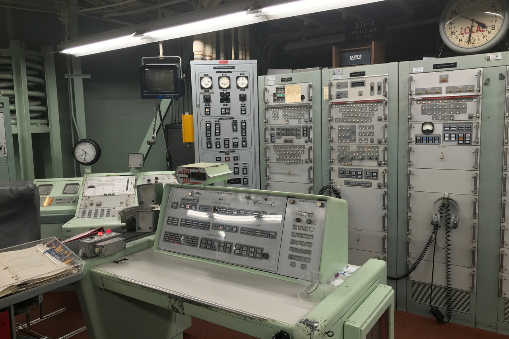
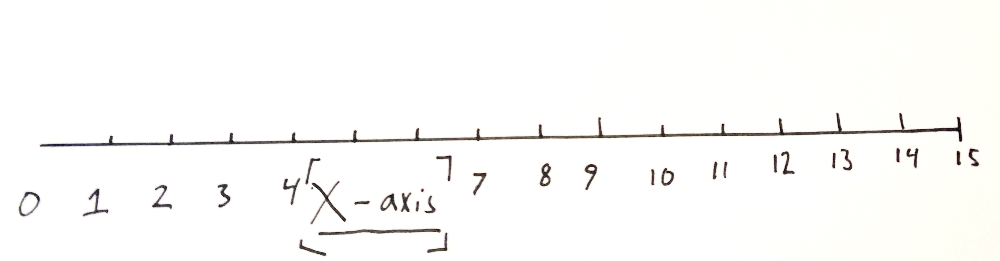
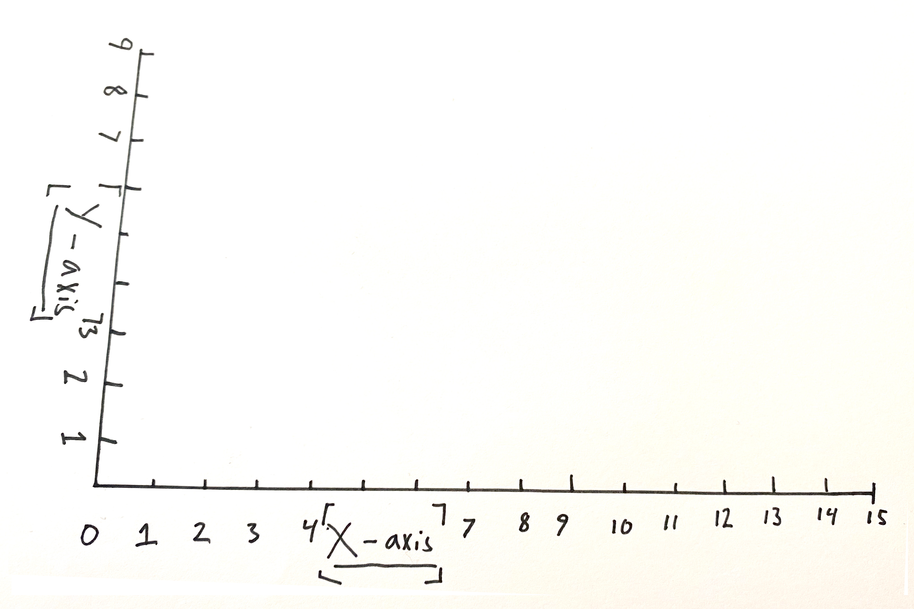
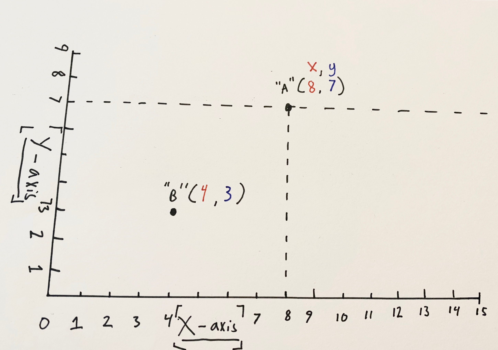
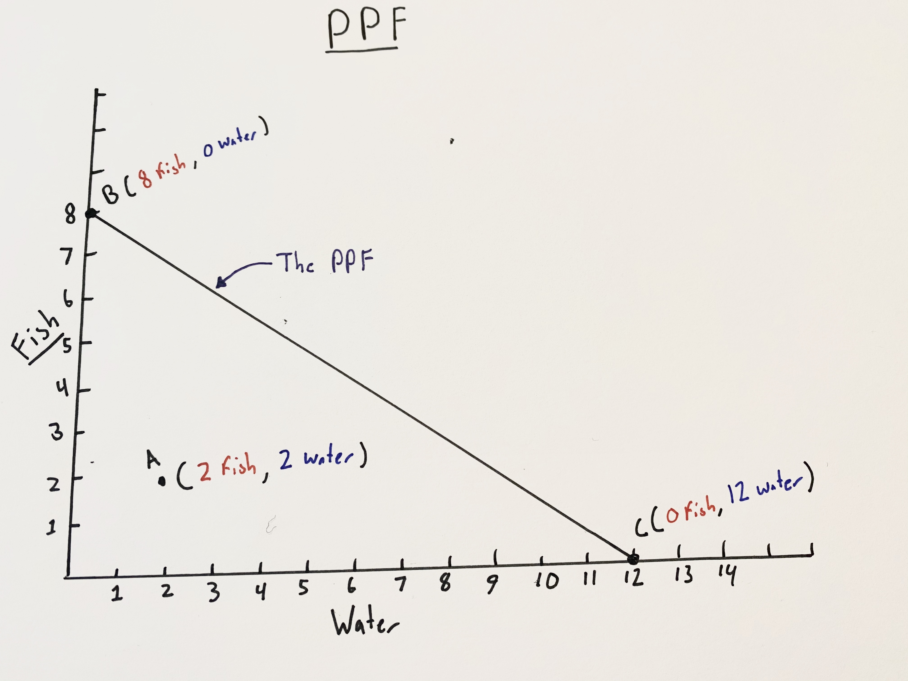
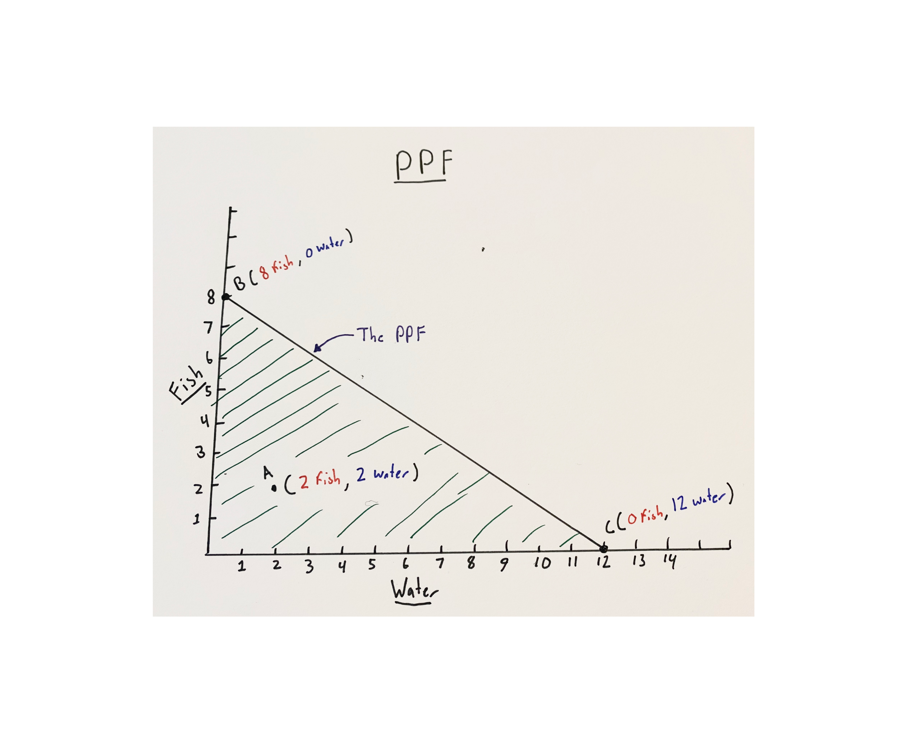
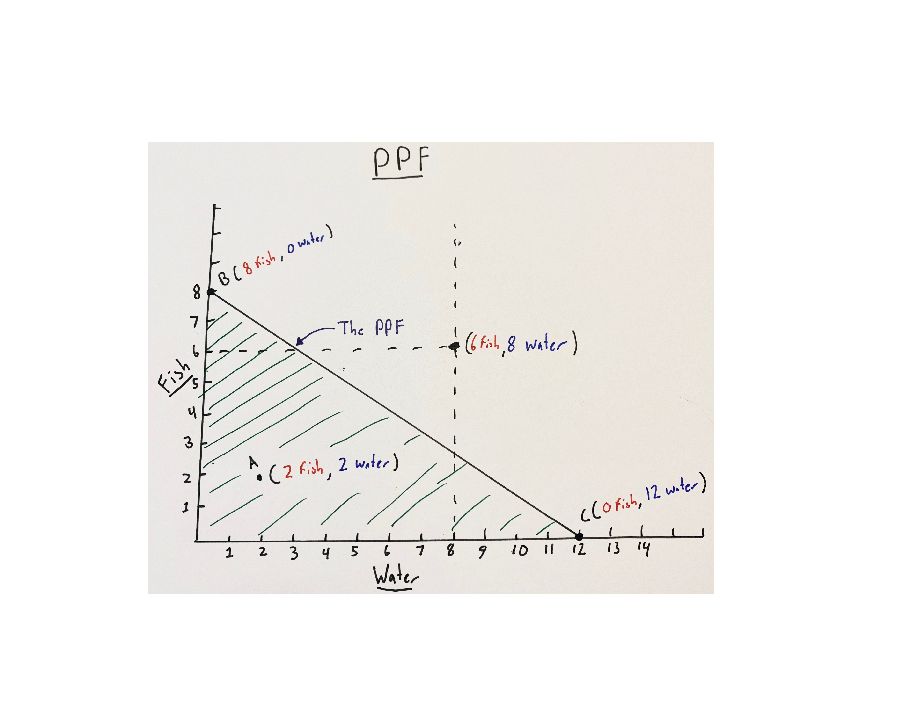
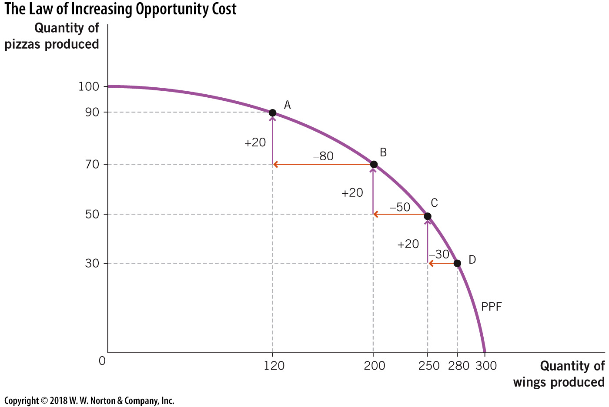
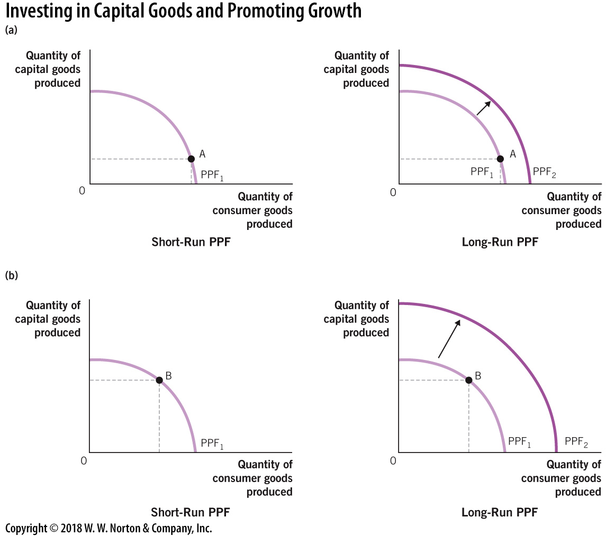

exclude: true

```{R, setup, include = F}
library(pacman)
p_load(
  broom, tidyverse,
  ggplot2, ggthemes, ggforce, ggridges, cowplot,
  latex2exp, viridis, extrafont, gridExtra, plotly,
  kableExtra, snakecase, janitor,
  data.table, dplyr,
  lubridate, knitr, future, furrr,
  estimatr, FNN, caret, parsnip,
  huxtable, here, magrittr
)
# Define colors
red_pink   = "#e64173"
turquoise  = "#20B2AA"
orange     = "#FFA500"
red        = "#fb6107"
blue       = "#3b3b9a"
green      = "#8bb174"
grey_light = "grey70"
grey_mid   = "grey50"
grey_dark  = "grey20"
purple     = "#6A5ACD"
slate      = "#314f4f"
# Knitr options
opts_chunk$set(
  comment = "#>",
  fig.align = "center",
  fig.height = 7,
  fig.width = 10.5,
  warning = F,
  message = F
)
opts_chunk$set(dev = "svg")
options(device = function(file, width, height) {
  svg(tempfile(), width = width, height = height)
})
options(knitr.table.format = "html")
```
---
layout: true
# Admin

---
class: inverse, middle
---
name: admin-soon
# Admin

## Upcoming

.hi-slate[Readings & Assignments]

- .note[This Week]
  - Reading: Ch1–Ch2
  - Inquizitive Assignments 'How-to, Ch 1 and 2 due Saturday (4/4) at 11:59pm'.
  - Smartwork Quiz 1 Due Saturday (4/4) at 11:59
- .note[Next week]
  - Reading: Ch. 3, Supply and Demand
  - Smartwork Quiz 2 Due Wednesday Next week, (4/8)
  
---
layout: true
# Review

---
class: inverse, middle
---
name: sl-definition

 - .hi[Five Pillars of Economics]
 
--

.qa[Incentives] describe what causes individuals to make choices. These can be negative, positive, direct, or indirect.
 
--

.qa[Trade-offs] Every choice that is interesting features some benefits and some lost opportunities. These are tradeoffs.

--

.qa[Opportunity Cost] Every choice that features tradeoffs will have opportunity costs that come from giving up our next best alternative.

--

.qa[Thinking on the Margin] Every quantity choice really boils down to whether the next unit of that item makes the chooser better off or worse off.

--

.qa[Benefits from Specialization] The economy you know functions on a group of highly trained and specialized individuals working together and trading to create value.

---
name: sl-definition
## Last time

- .hi[Positive vs. Normative Analysis]

--

.qa[Positive Analysis] A testable statement that requires only data to prove true or false

--

.qa[Normative Analysis] A non-testable statement that talks about what **should** be true.


---
name: sl-definition
## Last time

.pull-left[.hi[Positive Analysis]

- testable
]

.pull-right[.hi-orange[Normative Analysis]

- not testable
]

--

- the economy is doing well

--

- The unemployment rate will rise by 10%

--

- Everyone should have 2 months worth of savings for an emergency fund.

--

- There should be a baby boom in 9 months

---
name: sl-definition
## Last time

.pull-left[.hi[Positive Analysis]

- testable
]

.pull-right[.hi-orange[Normative Analysis]

- not testable
]

- .hi-orange[the economy is doing well]

- .hi[The unemployment rate will rise by 10%]

- .hi-orange[Everyone should have 2 months worth of savings for an emergency fund.]

- .hi[There should be a baby boom in 9 months]

---
layout: true
# Economic Models

---
name: sl-classes
## Context

--

Economics in its modern form, is actually a .hi[fairly recent development] as far as the sciences are concerned.

--
Economists trace Economics back to Adam Smith's *Wealth of Nations* written in 1776.orange[*]

.footnote[

.orange[*]The ideas in this book were originally developed by the Tunisian scholar, Ibn Khaldun in "The Muqaddimah" from 1337

]

--

Contextually, this means that many of the ideas in Economics arose at the same time as Darwinian thought, during the peak of Romanticism and nearly simulataneously with 'the scientific method.'

--

These ideas strongly influence how Economists think about how to solve problems, even today.

---
## The Scientific Method

Generally, the scientific method consists of:

- An observation (.qa[when I put my hand on the burner, it hurts!])

--

- A hypothesis (.qa[my hand hurts because the burner is hot!])

--

- Build a model (.qa[As temperature in the burner increases, my hand hurts more!])

--

- Test the model, usually with statistics (.qa[I will place my hand on the burner at a variety of temperatures])

--

- Refine the model based on observation (.qa[Only once the burner reaches a certain threshold do I begin to feel pain!])

---
name: sl-classes
## Economic Models

--
However, economists for the most part study things that can't be contained in a laboratory.

--

.qa[Ex.] How would we run an experiment on the effect of minimum wage on prices of food in grocery stores?

--

This means most economic theory is generated by waiting for the world to create .hi[natural experiments]

--

.qa[Ex.] Does an increase in Seattle's minimum wage to 15$ an hour cause prices in Seatle's grocery stores to increase? Evidence currently points to no.

---
layout: true
# Economic Models

---
class: inverse, middle
---
## Economic Models

Coming up with answers to economic problems is inherently complex: the goal is to think about the outcome of how hundreds if not thousands of individual choices can cause changes in an economy.

--

The significance of these choices is equally massive: billions of humans every day are seriously impacted by even small shifts in prices and quantities.

--

In order to learn anything from these models, we need to .hi[simplify] our world so that we can understand each moving piece, one at a time.

--

The way Economists do this is by studying observed phenomenon in markets and choices .hi-orange[ceteris paribus]

---
## Ceteris Paribus

Ceteris Paribus is a term that means .hi[all else equal.] Alternatively, "with other conditions remaining the same."

--

In economics, social scientists use *ceteris paribus* to mean that, outside of the variables included in our model, our other variables aren't changing.

--

At first glance, this may seem counter-intuitive to you, but it's actually a very necessary assumption in order to understand how the economy works.

---
## Example

I want you to imagine that you walk up to a control panel that looks like this:

```{R, nuclearsilo, echo = F, out.width = '50%'}

```

--

.hi[but you knew nothing about it]
---
## Example

How do you go about figuring out what it does?

--

One option is to just turn a bunch of dials/push buttons all at once, and then when something happens, assume you turned the right dials.

--

However, you .hi[won't know] if it was the last button/dial alone that had the effect or if it was some combination of buttons you pushed

--

The other option is to turn the dials/push the buttons one at a time/a few at a time, and record the results. This lets you isolate effects from specific buttons/dials
---
## The Modeled Economy

Unfortunately, .hi-orange[markets] work without much economist interference, so instead, we have to create models to think about what happens when dials are turned on their own.

--

When we do this, we have to separate our variables (dials, from our example) into two categories:

--

- .hi-orange[Included variables] (endogenous, meaning having an internal cause)

--

- .hi[Excluded variables] (exogenous, meaning having an external cause)

---

## Assumptions

Because we don't live in a world that has easy laboratories for economics, we need to make reasonable assumptions about how humans will behave.

--

One such assumption is what variables we .hi-orange[choose to include] in a model

--

Another common assumption is that we will assume humans are .hi[rational creatures] and reasonably will try to maximize their own incentives (consumption in most cases) whenever they make choices.

--

This is a simplifying assumption, but is more robust to testing than it seems. At the end of the course, we'll explore how humans sometimes do not behave this way in real life.

--

Generally, in the history of economics however, this assumption has been fairly robust.

---

## Assumptions

Assumptions are one of the most important things to evaluate in a model - you should think about any economic model you see and ask yourself:

--

- .hi[Do I believe the assumptions here?]

--

 -.hi[What would happen if these assumptions were wrong?]

--

This is how economic models grow - by questioning the assumptions and building more complex and realistic models from them.

---
layout: true
# Production Possibilities Frontier

---
class: inverse, middle
---
## PPF

So let's build our first economic model together. We're going to recreate a model that's used in a variety of economic fields.

--

We're going to make a .hi[production possibilities frontier (ppf)] model. This model describes what resources a person, firm or nation can produce using what tools, knowledge and abilities they might have available.

--

Remember .hi-orange[ceteris paribus]? 
--
We need to figure out what dials we want to remain steady so we can slowly add them back into our model.

--

we're going to assume that available tools, knowledge-bases and abilities stay fixed. This is common in economics, since at any moment in time, it's difficult to instantaneously materialize those things.
---

## PPF

To keep things simple, we're also going to set our model on a theoretical desert island with two stranded people and two 'goods' that can be produced with our resource: .hi-purple[time].

--

These goods are going to be .hi-orange[fish] and .hi[water]. We're just trying to survive here!

--

Let's say we have 10 hours a day we can be doing survival activities, there's some maximum amount of fish we can scavenge.

--

Similarly, there's some maximum amount of water we can gather in 10 hours.

---

## PPF

Of course, one assumption is that we can choose to gather .hi[less] fish or water on this island. 

--

Our assumption is that getting fewer resources takes .hi[less] time. Further, getting .hi-orange[more] resources, will take .hi-orange[more] time. This is true for both water and fish.

--

These assumptions seem reasonable, yes? 

--

This means is we're using all of our resources (time here) efficiently, there is some production frontier beyond which we cannot reach.

---

## PPF

Now - we're going to do our very first .hi-orange[graph.] Graphs are visual representations of models, and do a great job of letting you see all the moving parts at once.

--

First though, I'm going to review how .hi[graphs] work. You guys likely know this already.
---
layout: true
# Graphing

---
class: inverse, middle

---

## Number line

The most basic graph:

```{r, echo = F, out.width='80%'}

```


---

## 2D Graphs

```{r, echo = F, out.width='80%'}

```

---

## Points
```{r, echo = F, out.width='80%'}
knitr::include_graphics('images/graph3.png')
```

---
## Points
```{r, echo = F, out.width='80%'}
knitr::include_graphics('images/graph4.png')
```

---

## Points
```{r, echo = F, out.width='80%'}

```

---

## Points
```{r, echo = F, out.width='80%'}
knitr::include_graphics('images/graph7.png')
```

$$Slope \ of\ c \to b:\ \frac{rise}{run} = \frac{3-1}{4-1}=\frac{2}{3}$$
---

## Graphs in Economic Space
```{r, echo = F, out.width='80%'}
knitr::include_graphics('images/PPF1.png')
```

---

## Graphs in Economic Space
```{r, echo = F, out.width='80%'}

```

---

## Graphs in Economic Space
```{r, echo = F, out.width='80%'}

```

---

## Graphs in Economic Space
```{r, echo = F, out.width='90%'}

```
---
layout: true
# Learning from the PPF

---
class: inverse, middle

---

## PPF and Gains from Trade


```{r, plotppfsj, out.width = '45%', out.height='45%', echo = F}
ppfuncjohn <- function(x) -(1/3)*x + 1
ppfuncerika <- function(x) -(1/2)*x+3

p = ggplot(data = data.frame(x=0), aes(x=x))

p_1 = p + stat_function(fun = ppfuncjohn) + xlim(0,7) + ylim(0,7) + xlab("Water") + ylab("Fish") + theme_minimal() + stat_function(fun = ppfuncjohn, xlim = c(0,7), geom = 'area', alpha = .25, fill = red_pink) + labs(title = "John's PPF")
```

```{r, plotppfse, out.width = '80%', out.height='80%', echo = F}
p_2 = p + stat_function(fun = ppfuncerika) + xlim(0,7) + ylim(0,7) + xlab("Water") + ylab("Fish") + theme_minimal() + stat_function(fun = ppfuncerika, xlim = c(0,7), geom = 'area', alpha = .25, fill = purple) + labs(title = "Erika's PPF")

grid.arrange(p_2, p_1, ncol=2)
```
---

## PPF and Gains From Trade
```{r, echo = F}
text_tbl <- data.frame(
  Islanders = c("Erika", "John"),
  Water = c(
    6,3
  ),
  Fish = c(
    3,1
  ),
  water = c(
    '1/2 fish', '1/3 fish'
  ),
  fish = c(
    '2 water', '3 water'
  )
)

kable(text_tbl) %>%
  kable_styling(c("striped", "bordered")) %>%
  column_spec(1, bold = T, border_right = T) %>%
  column_spec(2, width = "10em", background = "white") %>%
  column_spec(3, width = "10em", background = "white") %>%
  column_spec(4, width = "15em", background = "white") %>%
  column_spec(5, width = "15em", background = "white") %>% 
  add_header_above(c(" " = 1, "Max Individual Production" = 2, "Opportunity Cost" = 2))
```

--

Well .hi[John's] a smart economist, so he starts thinking about how he could still survive on this island. After thinking into the night, he brings a deal to Erika.
--

He points out that every time Erika goes to get water, she gives up $\frac{1}{2}$ of a fish, but every time **he** goes out, he only gives up $\frac{1}{3}$ of a fish.

---

## John's Proposal

John proposes that Erika do what she's best at - catching fish, while he goes and gets the water. She rightfully says that she can get .hi[more] water than John.

--

He concedes this point, but says:

I'll trade you 2.5 of my .hi[water] for just 1 of your .hi-orange[fish].

--

After thinking about it, Erika agrees, because she can now have both more water and more fish than she could on her own.
---

## After Trade

```{r, echo = F}
text_tbl <- data.frame(
  Islanders = c("Erika", "John"),
  Water = c(
    6,3
  ),
  Fish = c(
    3,1
  ),
  water = c(
    '1/2 fish', '1/3 fish'
  ),
  fish = c(
    '2 water', '3 water'
  ),
  consumed_Water = c(
    '2.5 (from John)',
    '.5 (left over)'
  ),
  consumed_Fish = c(
    '2 (left over)',
    '1 (from Erika)'
  )
)

kable(text_tbl) %>%
  kable_styling(c("striped", "bordered")) %>%
  column_spec(1, bold = T, border_right = T) %>%
  column_spec(2, width = "10em", background = "white") %>%
  column_spec(3, width = "10em", background = "white") %>%
  column_spec(4, width = "15em", background = "white") %>%
  column_spec(5, width = "15em", background = "white") %>% 
  add_header_above(c(" " = 1, "Max Individual Production" = 2, "Opportunity Cost" = 2, "After Trading" = 2))
```
---

```{r, plotppfsj2, out.width = '45%', out.height='45%', echo = F}
ppfuncjohn <- function(x) -(1/3)*x + 1
ppfuncerika <- function(x) -(1/2)*x+3

p = ggplot(data = data.frame(x=0), aes(x=x))

p_1 = p + stat_function(fun = ppfuncjohn) + xlim(0,7) + ylim(0,7) + xlab("Water") + ylab("Fish") + theme_minimal() + stat_function(fun = ppfuncjohn, xlim = c(0,7), geom = 'area', alpha = .25, fill = red_pink) + labs(title = "John's PPF") + geom_point(x = .5, y =1, color = 'red') + geom_text(x = .5, y = 1.15, label = 'after trade')
```

```{r, plotppfse2, out.width = '90%', out.height='90%', echo = F}
p_2 = p + stat_function(fun = ppfuncerika) + xlim(0,7) + ylim(0,7) + xlab("Water") + ylab("Fish") + theme_minimal() + stat_function(fun = ppfuncerika, xlim = c(0,7), geom = 'area', alpha = .25, fill = purple) + labs(title = "Erika's PPF") + geom_point(x = 2.5, y = 2, colour = 'red') + geom_text(x = 2.5, y = 2.15, label = 'after trade')

grid.arrange(p_2, p_1, ncol=2)
```
---

## PPF Trading Terms

Ok, so how do we figure out what rates Erika and John would be willing to trade at?

--

It all boils down to the opportunity cost for each person of each .hi[good] or .hi-orange[activity]

--
```{r, echo = F}
text_tbl <- data.frame(
  Islanders = c("Erika", "John"),
  Water = c(
    '1/2 fish', '1/3 fish'
  ),
  Fish = c(
    '2 water', '3 water'
  )
)

kable(text_tbl) %>%
  kable_styling(c("striped", "bordered")) %>%
  column_spec(1, bold = T, border_right = T) %>%
  column_spec(2, width = "10em", background = "white") %>%
  column_spec(3, width = "10em", background = "white") %>%
  add_header_above(c(" " = 1, "Opportunity Cost" = 2))
```

**Notice:** John's .hi[opportunity cost] for water is 1/3 of a fish.

--

**Notice:** Erika's .hi[opporunity cost] for water is 1/2 of a fish

.hi-purple[This means we've got room for trade!]
---

## Comparative Vs. Absolute Advantage

We know already that Erika can produce more fish and more water than John can. Economists would say she has .hi[absolute] advantage in producing both fish and water.

--

There can be benefits from trade however, so long as John has .hi-orange[comparative advantage] in something. 
--
The good news for John is that that is almost always the case.

--

.qa[Def'n:] A person, firm or nation has .hi-orange[comparative advantage] in producing a good if their .hi-purple[opportunity cost] is lower than their trading partner's.

--

Think of .hi-purple[opportunity cost] as the price of one good in terms of another. For instance, in our example, the opportunity cost of a fish is equal to the price of that fish in terms of water.

---

## Comparative Advantage and Trade

Let's do a new example using countries

--

```{r, echo = F}
text_tbl <- data.frame(
  Nations = c("Italy", "Ireland"),
  Butter = c(
    '50 tons', '210 tons'
  ),
  Pasta = c(
    '70 tons', '30 tons'
  ),
  butter = c('1 butter costs ? pasta', '1 butter costs ? pasta'),
  pasta = c('1 pasta costs ? butter', '1 pasta costs ? butter')
)

kable(text_tbl) %>%
  kable_styling(c("striped", "bordered")) %>%
  column_spec(1, bold = T, border_right = T) %>%
  column_spec(2, width = "10em", background = "white") %>%
  column_spec(3, width = "10em", background = "white") %>%
  column_spec(4, width = "15em", background = "white") %>%
  column_spec(5, width = "15em", background = "white") %>% 
  add_header_above(c(" " = 1, "Max National Production" = 2, "Opportunity Cost" = 2))
```
---

```{r, plotppfnat1, out.width = '45%', out.height='45%', echo = F}
ppfuncjohn <- function(x) -(1/7)*x + 30
ppfuncerika <- function(x) -(7/5)*x+70

p = ggplot(data = data.frame(x=0), aes(x=x))

p_1 = p + stat_function(fun = ppfuncjohn) + xlim(0,210) + ylim(0,80) + xlab("Butter") + ylab("Pasta") + theme_minimal() + stat_function(fun = ppfuncjohn, xlim = c(0,210), geom = 'area', alpha = .25, fill = red_pink) + labs(title = "Ireland's PPF")
```

```{r, plotppfnat, out.width = '90%', out.height='90%', echo = F}
p_2 = p + stat_function(fun = ppfuncerika) + xlim(0,210) + ylim(0,80) + xlab("Butter") + ylab("Pasta") + theme_minimal() + stat_function(fun = ppfuncerika, xlim = c(0,70), geom = 'area', alpha = .25, fill = purple) + labs(title = "Italy's PPF")

grid.arrange(p_2, p_1, ncol=2)
```

---

## Comparative Advantage and Trade

Let's do a new example using countries

```{r, echo = F}
text_tbl <- data.frame(
  Nations = c("Italy", "Ireland"),
  Butter = c(
    '50 tons', '210 tons'
  ),
  Pasta = c(
    '70 tons', '30 tons'
  ),
  butter = c('1 butter costs 7/5 pasta', '1 butter costs 1/7 pasta'),
  pasta = c('1 pasta costs 5/7 butter', '1 pasta costs 7 butter')
)

kable(text_tbl) %>%
  kable_styling(c("striped", "bordered")) %>%
  column_spec(1, bold = T, border_right = T) %>%
  column_spec(2, width = "10em", background = "white") %>%
  column_spec(3, width = "10em", background = "white") %>%
  column_spec(4, width = "15em", background = "white") %>%
  column_spec(5, width = "15em", background = "white") %>% 
  add_header_above(c(" " = 1, "Max National Production" = 2, "Opportunity Cost" = 2))
```

--

Who has .hi[absolute advantage] in Pasta? 
--
In Butter?

--

Who has .hi[comparative advantage] in Pasta? 
--
In Butter?
---

## Finding the trading rate

Back to John and Erika...

--

So long as the trading rate is such that: $\frac{1 \ fish}{3 \ water} \leq trading \  rate \leq \frac{1 \ fish }{2 \ water}$

--

Then Erika is willing to accept, because she would be getting $2\ water \leq traded\ water \leq 3\ water$ per fish.

--

By collaborating with John, she can take advantage of his lower opportunity cost and get more water for her fish than she could on her own.

--

John, on the other hand, gets $\frac{1}{3} \leq traded\ fish \leq \frac{1}{2}$ fish for every water he trades, meaning he could get as many as 1.5 fish (for 3 water) from Erika without Erika being any worse off. 
--
That's $50\%$ more fish than he could get on his own!

---
## PPF modifications

Awesome! So we now have evidence that .hi[specialization] and .hi-orange[the option to trade] allows the participants to consume more than they could on their own.

--

But now let's play around with our assumptions here. The .hi-orange[linear] nature of the PPF is assuming opportunity costs are constant.

--

But remember **Marginal Thinking**?

--

It probably makes sense that as we spend .hi[more] time fishing, for instance, we actually catch fewer and fewer fish. So what happens if .hi-orange[opportunity costs] are not constant?

---

```{r, plot2, out.width = '100%', out.height='100%', echo = F}
ppfunc <- function(x) sqrt(-x^2 + 100)

p = ggplot(data = data.frame(x=0), aes(x=x))

p_1 = p + stat_function(fun = ppfunc) + xlim(0,10) + ylim(0,10) + xlab("Water") + ylab("Fish") + theme_minimal() + stat_function(fun = ppfunc, xlim = c(0,10), geom = 'area', alpha = .25, fill = 'green')

p_1
```
---

Unfortunately - this makes finding opportunity costs kind of gross. It involves calculus, so this course won't make you do that. However, if you're interested:

--

We can find the opportunity cost for water by $-\frac{d\ fish}{d\ water} = \frac{water}{\sqrt{100-water^2}}$

--

```{r, echo = F}
text_tbl <- data.frame(
  Production_Level = c("Producing 5 Water", "Producing 3 Water"),
  Water = c(
    '~.6 fish', '~.3 fish'
  ),
  Fish = c(
    '~1.7 water', '~3.2 water'
  )
)

kable(text_tbl) %>%
  kable_styling(c("striped", "bordered")) %>%
  column_spec(1, bold = T, border_right = T) %>%
  column_spec(2, width = "10em", background = "white") %>%
  column_spec(3, width = "10em", background = "white") %>%
  add_header_above(c("Water Produced" = 1, "Opportunity Cost" = 2))
```

---

If you're more of a visual learner like myself, this graph likely will help you understand what's going on here:

--

```{r, echo = F, out.width = '90%'}

```

---

## Turning some dials

Now that we've established a model, and how changing the assumptions change the model, let's .hi[turn some dials].

--

By that, I mean we're going to change the values of an .hi-orange[exogenous variable]. Specifically, we're going to introduce technology changes.

--

.qa[def:] Technology: anything that turns .hi[inputs] (time from our last model) into .hi-orange[outputs]. Let's look at what happens when we improve our fishing technology - maybe Erika invents a boat!

---

## Inventing the boat

```{r, echo = F, out.width = '80%'}
ppfuncerika <- function(x) -(1/2)*x+3
ppfuncerika2 <- function(x) -x + 6
p1 = p + stat_function(fun = ppfuncerika) + xlim(0,7) + ylim(0,7) + xlab("Water") + ylab("Fish") + theme_minimal() + stat_function(fun = ppfuncerika, xlim = c(0,7), geom = 'area', alpha = .15, fill = purple) + labs(title = "Erika's PPF Pre-boat")

p2 = p+ stat_function(fun = ppfuncerika2) + stat_function(fun = ppfuncerika2, xlim = c(0,7), geom = 'area', alpha = .25, fill = purple) + xlim(0,7) + ylim(0,7) + xlab("Water") + ylab("Fish") + theme_minimal() + stat_function(fun = ppfuncerika, xlim = c(0,7), geom = 'area', alpha = .5, fill = purple) + labs(title = "Erika's PPF post-boat")

grid.arrange(p1, p2, ncol=2)
```
---
### What if the technology impacted both

```{r, echo = F, out.width = '80%'}
ppfuncerika <- function(x) -(1/2)*x+3
ppfuncerika2 <- function(x) -(1/2)*x + 6
p1 = p + stat_function(fun = ppfuncerika) + xlim(0,12) + ylim(0,7) + xlab("Water") + ylab("Fish") + theme_minimal() + stat_function(fun = ppfuncerika, xlim = c(0,7), geom = 'area', alpha = .15, fill = purple) + labs(title = "Erika's PPF Pre-technology")

p2 = p+ stat_function(fun = ppfuncerika2) + stat_function(fun = ppfuncerika2, xlim = c(0,12), geom = 'area', alpha = .25, fill = purple) + xlim(0,12) + ylim(0,7) + xlab("Water") + ylab("Fish") + theme_minimal() + stat_function(fun = ppfuncerika, xlim = c(0,7), geom = 'area', alpha = .5, fill = purple) + labs(title = "Erika's PPF post-technology")

grid.arrange(p1, p2, ncol=2)
```

---
## Choice between now and later

--

```{r, echo = F, out.width='75%', out.height = '75%'}

```

---
layout: true
# Examples

---
class: inverse, middle

---

## Examples and Applications

```{r, echo = F}

```
---

## Examples and Applications

1.) .qa[What] are the likely effects from only using US-produced coronavirus tests?

--

.qa[A] If the tests from overseas are just as accurate as the tests here (which appears to be the case) - then our trade model says that we'll likely have .hi[fewer] tests we can perform.

--

2.) .qa[What] unintended consequences might forcing factories to make ventilators have on manufacturing?

--

.qa[A] If we think the law of increasing marginal cost (or decreasing marginal benefit) is in place here, the total manufacturing output (by unit) might fall quite a bit! However, because the demand (we'll talk about this next week) for those machines is so high, we can't say for certain what will happen to revenue.

---
exclude: true

```{R, save pdfs 1, include = F, eval = F}
system("`npm bin`/decktape remark 001-slides.html 001-slides.pdf --chrome-arg=--allow-file-access-from-files --slides 1-100")
```

```{R, save pdfs, include = F, eval = F}
# PDF with pauses
#xaringan::decktape("000-slides.html", "000-slides.pdf")
# PDF without pauses
pagedown::chrome_print("001-slides.html", "001-slides-no-pause.pdf")
```
